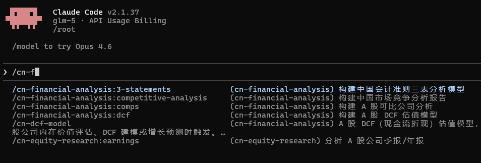

<p align="center">
  <h1 align="center">CN Financial Services Plugins</h1>
</p>

<p align="center">
  <strong>cn大陆金融市场 Claude 插件集合</strong><br/>
  A 股研究 · 金融分析 · 投行业务
</p>

<p align="center">
  <a href="./cn-financial-analysis">金融分析</a> ·
  <a href="./cn-equity-research">股票研究</a> ·
  <a href="./cn-investment-banking">投行业务</a> ·
  <a href="https://github.com/ccq1/cn-financial-mcp">MCP 数据源</a>
</p>

---

## 简介

**cn-financial-services-plugins** 是一套专为cn大陆金融市场设计的 [Claude](https://claude.ai) 插件集合，参考 Anthropic [financial-services-plugins](https://github.com/anthropics/financial-services-plugins) 架构，所有 Skills 和 Commands 针对 A 股市场、cn企业会计准则、cn监管体系深度本土化。

适用于 [Claude Code](https://docs.anthropic.com/en/docs/claude-code/overview)、[Claude Cowork](https://claude.com/product/cowork) 以及任何支持 Claude 插件协议的平台。

数据源通过 MCP 协议连接 [cn-financial-mcp](https://github.com/ccq1/cn-financial-mcp)（基于 AKShare），42 个金融数据工具，无需 API Key，开箱即用。

## 测试图片

这是个测试。



## 插件一览

| 插件 | 类型 | Skills | Commands | 功能 |
|------|------|--------|----------|------|
| [cn-financial-analysis](./cn-financial-analysis) | 核心（必装） | 4 | 4 | 可比公司分析、DCF 估值、三表建模、竞争分析 |
| [cn-equity-research](./cn-equity-research) | 附加 | 6 | 6 | 财报分析、首次覆盖、选股策略、晨报、行业综述、逻辑跟踪 |
| [cn-investment-banking](./cn-investment-banking) | 附加 | 4 | 4 | IPO 分析、并购模型、路演材料、债券发行 |

> **14 个 Skills · 14 个 Commands · 1 个 MCP 数据源**

## 全部命令

| 命令 | 插件 | 功能 |
|------|------|------|
| `/comps` | cn-financial-analysis | 构建 A 股可比公司分析 |
| `/dcf` | cn-financial-analysis | 构建 A 股 DCF 估值模型 |
| `/3-statements` | cn-financial-analysis | 构建cn会计准则三表分析模型 |
| `/competitive-analysis` | cn-financial-analysis | 构建cn市场竞争分析报告 |
| `/earnings` | cn-equity-research | 分析 A 股公司季报/年报 |
| `/initiate` | cn-equity-research | 撰写 A 股公司首次覆盖（深度研报） |
| `/screen` | cn-equity-research | A 股选股筛选 |
| `/morning-note` | cn-equity-research | 生成 A 股早盘晨报 |
| `/sector` | cn-equity-research | 生成 A 股行业综述报告 |
| `/thesis` | cn-equity-research | 跟踪投资逻辑和核心假设验证 |
| `/ipo` | cn-investment-banking | A 股 IPO 分析 |
| `/merger` | cn-investment-banking | cn并购重组分析 |
| `/pitch` | cn-investment-banking | 创建cn投行路演 PPT 材料 |
| `/bond` | cn-investment-banking | cn境内债券发行分析 |

## 安装

### 前置依赖

本插件集需要 [cn-financial-mcp](https://github.com/ccq1/cn-financial-mcp) 作为数据源。请先安装：

```bash
# 克隆 MCP 数据源
git clone https://github.com/ccq1/cn-financial-mcp.git ~/cn-financial-mcp

# 安装依赖
cd ~/cn-financial-mcp
pip install -e .
```

### 方式一：Claude Code（推荐）

```bash
# 克隆本仓库
git clone https://github.com/ccq1/cn-financial-services-plugins.git

# 添加 marketplace
claude plugin marketplace add ./cn-financial-services-plugins

# 安装核心插件（必装）
claude plugin install cn-financial-analysis@cn-financial-services-plugins

# 按需安装附加插件
claude plugin install cn-equity-research@cn-financial-services-plugins
claude plugin install cn-investment-banking@cn-financial-services-plugins
```

安装后，斜杠命令即可使用：

```bash
/comps 贵州茅台              # 可比公司分析
/dcf 宁德时代                # DCF 估值
/earnings 比亚迪 2025Q1      # 季报分析
/screen 低估值白马股          # 选股筛选
/morning-note                # 早盘晨报
/ipo 某科技公司               # IPO 分析
/merger A公司 收购 B公司      # 并购分析
/bond 某公司 中票             # 债券发行分析
```

### 方式二：手动配置

如果不通过 marketplace 安装，也可以手动使用：

1. 克隆仓库：

```bash
git clone https://github.com/ccq1/cn-financial-services-plugins.git
```

2. 在你的项目中配置 `.mcp.json`，连接 cn-financial-mcp：

```json
{
  "mcpServers": {
    "cn-financial": {
      "type": "stdio",
      "command": "python",
      "args": ["-m", "cn_financial_mcp"]
    }
  }
}
```

> 如果没有 `pip install -e .` 安装 cn-financial-mcp，需要手动指定路径：
> ```json
> {
>   "mcpServers": {
>     "cn-financial": {
>       "type": "stdio",
>       "command": "python",
>       "args": ["-m", "cn_financial_mcp"],
>       "cwd": "~/cn-financial-mcp/src",
>       "env": {
>         "PYTHONPATH": "~/cn-financial-mcp/src"
>       }
>     }
>   }
> }
> ```

3. 在对话中引用 SKILL.md 文件即可使用相应能力。

## 项目结构

```
cn-financial-services-plugins/
├── .claude-plugin/
│   └── marketplace.json                    # 插件市场清单
├── CLAUDE.md                               # 项目说明
├── README.md
│
├── cn-financial-analysis/                  # 核心金融分析（必装）
│   ├── .claude-plugin/plugin.json
│   ├── .mcp.json
│   ├── commands/
│   │   ├── comps.md                        # /comps
│   │   ├── dcf.md                          # /dcf
│   │   ├── 3-statements.md                 # /3-statements
│   │   └── competitive-analysis.md         # /competitive-analysis
│   ├── skills/
│   │   ├── comps-analysis/SKILL.md         # 可比公司分析
│   │   ├── dcf-model/SKILL.md              # DCF 估值（人民币 WACC）
│   │   ├── 3-statements/SKILL.md           # 三表分析（cn会计准则）
│   │   └── competitive-analysis/SKILL.md   # 竞争分析（产业链+波特五力）
│   └── hooks/hooks.json
│
├── cn-equity-research/                     # A 股研究
│   ├── .claude-plugin/plugin.json
│   ├── .mcp.json
│   ├── commands/
│   │   ├── earnings.md                     # /earnings
│   │   ├── initiate.md                     # /initiate
│   │   ├── screen.md                       # /screen
│   │   ├── morning-note.md                 # /morning-note
│   │   ├── sector.md                       # /sector
│   │   └── thesis.md                       # /thesis
│   ├── skills/
│   │   ├── earnings-analysis/SKILL.md      # 季报/年报分析
│   │   ├── initiating-coverage/SKILL.md    # 首次覆盖报告（30-50页）
│   │   ├── idea-generation/SKILL.md        # 选股策略（量化筛选+资金流向）
│   │   ├── morning-note/SKILL.md           # 早盘晨报
│   │   ├── sector-overview/SKILL.md        # 行业综述
│   │   └── thesis-tracker/SKILL.md         # 投资逻辑跟踪
│   └── hooks/hooks.json
│
└── cn-investment-banking/                  # cn投行
    ├── .claude-plugin/plugin.json
    ├── .mcp.json
    ├── commands/
    │   ├── ipo.md                          # /ipo
    │   ├── merger.md                       # /merger
    │   ├── pitch.md                        # /pitch
    │   └── bond.md                         # /bond
    ├── skills/
    │   ├── ipo-analysis/SKILL.md           # IPO 分析（四板条件对比）
    │   ├── merger-model/SKILL.md           # 并购模型（业绩承诺+增厚/摊薄）
    │   ├── pitch-deck/SKILL.md             # 路演 PPT
    │   └── bond-issuance/SKILL.md          # 债券发行（企业债/短融/中票/ABS）
    └── hooks/hooks.json
```

## cn市场本土化

所有 Skills 均深度适配cn大陆金融市场：

| 维度 | 内容 |
|------|------|
| **会计准则** | cn企业会计准则（CAS），利润表/资产负债表/现金流量表中文标准科目 |
| **估值体系** | PE-TTM、PB-ROE 框架、PS、PEG、DCF（人民币 WACC + cn十年期国债 Rf） |
| **行业分类** | 申万行业分类（31 个一级、134 个二级行业） |
| **交易制度** | T+1、涨跌停（主板 10%、科创板/创业板 20%、北交所 30%） |
| **监管框架** | 证监会、上交所、深交所、北交所、交易商协会 |
| **特色指标** | 北向资金、融资融券、龙虎榜、大宗交易、限售解禁、扣非净利润 |
| **IPO 制度** | 注册制、科创板/创业板/主板/北交所四板上市条件完整对比 |
| **并购规则** | 《重大资产重组管理办法》、业绩承诺与补偿、增厚/摊薄分析 |
| **债券品种** | 企业债、公司债、短融、中票、超短融、PPN、ABS 全品种覆盖 |

## MCP 数据源

所有插件共享 [cn-financial-mcp](https://github.com/ccq1/cn-financial-mcp) 数据连接器，提供 42 个金融数据工具：

| 能力 | 工具 |
|------|------|
| 公司搜索与基本信息 | `search_stock`、`get_company_info`、`get_competitors` |
| 实时行情与历史价格 | `get_realtime_quote`、`get_historical_price`、`get_minute_data` |
| 三大财务报表 | `get_income_statement`、`get_balance_sheet`、`get_cash_flow` |
| 财务指标与估值 | `get_financial_indicators`、`get_valuation_metrics` |
| 行业与板块 | `get_industry_list`、`get_industry_stocks`、`get_concept_list` |
| 市场总览 | `get_market_overview`、`get_stock_list`、`get_market_capitalization` |
| 新闻与公告 | `get_stock_news`、`get_company_announcements` |
| 宏观与外汇 | `get_macro_indicators`、`get_exchange_rate` |

无需 API Key，基于 [AKShare](https://akshare.akfamily.xyz) 开源库，内置东方财富/新浪/腾讯/同花顺多数据源自动 fallback。

## 插件工作原理

```
用户输入（自然语言或斜杠命令）
       │
       ▼
┌─────────────┐
│  Claude AI  │ ← Skills 提供领域知识和工作流指引
│             │ ← Commands 定义具体操作步骤
└──────┬──────┘
       │ MCP 协议
       ▼
┌─────────────────┐
│ cn-financial-mcp │ ← 42 个金融数据工具
│   (AKShare)      │ ← 东方财富/新浪/腾讯/同花顺
└─────────────────┘
       │
       ▼
  A 股实时行情、财报、行业、宏观数据
```

- **Skills**（`skills/*/SKILL.md`）：编码领域专业知识和分步工作流。Claude 在相关场景下自动调用，无需手动触发。
- **Commands**（`commands/*.md`）：用户通过斜杠命令主动触发的操作。
- **MCP 连接器**（`.mcp.json`）：通过 [Model Context Protocol](https://modelcontextprotocol.io) 将 Claude 连接到外部数据源。

所有组件都是纯文件 — Markdown 和 JSON，无代码，无基础设施，无构建步骤。

## 定制化

这些插件是起点，真正的价值在于按你的需求定制：

- **更换数据源** — 编辑 `.mcp.json` 指向你的私有数据服务或付费终端
- **添加公司上下文** — 在 Skill 文件中加入你的术语、流程和格式标准
- **调整工作流** — 按团队的实际分析方法修改 Skill 指令
- **新建插件** — 参照现有结构为未覆盖的工作流创建新插件

## 相关项目

- [cn-financial-mcp](https://github.com/ccq1/cn-financial-mcp) — cn大陆金融数据 MCP Server（本插件集的数据源）
- [financial-services-plugins](https://github.com/anthropics/financial-services-plugins) — Anthropic 官方金融服务插件（本项目的架构参考）
- [AKShare](https://akshare.akfamily.xyz) — 开源金融数据接口库

## License

[Apache-2.0](./LICENSE)

## 免责声明

这些插件辅助金融分析工作流，不构成投资建议。AI 生成的分析结果应由金融专业人士审核后方可用于投资决策。
